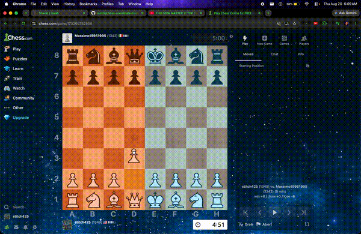

# Chess Coordinate Trainer

A Chrome extension that displays algebraic coordinates when pieces move on Chess.com.



## Why I Built This

I could see where pieces were on a chessboard, but algebraic coordinates weren't automatic. When someone said "knight to f6," I had to consciously translate rather than just knowing where f6 was.

Instead of drilling coordinates separately, I wanted something that would reinforce them while I was already playing. Every move becomes a small repetition: piece lands, coordinate appears, coordinate fades. Over time, the mapping becomes instinctive.

## What It Does

When a piece moves on Chess.com:

1. The extension detects the destination square
2. The algebraic coordinate (e.g., "E4") appears on that square
3. The board's edge coordinates glow briefly
4. After ~0.7 seconds, the label fades out
5. Play continues normally

The coordinate labels are color-coded by board region (queenside lower, queenside upper, kingside lower, kingside upper) to build spatial awareness.

You can also right-click any square to see its coordinate.

## Features

- **Move detection** - Automatically shows coordinates when pieces move
- **Spatial overlays** - Color tints for flanks (queenside/kingside) or ranks (your half/their half)
- **Coordinate display modes** - Full coordinate (A1), file only (A), or rank only (1)
- **Edge label glow** - Board's A-H and 1-8 labels glow when that file/rank is involved
- **Right-click reveal** - Click any square to see its coordinate
- **Flipped board support** - Works correctly when playing as black
- **Status tooltip** - Shows current mode when toggling

## What This Is Not

This tool helps you learn the board's coordinate system. It doesn't analyze positions or suggest moves.

It does not provide:

- Engine analysis
- Move recommendations
- Position evaluation
- Threat detection
- Opening theory

The goal is representation, not decision-making. You learn to see e4 as e4, not to be told whether e4 is good.

## Installation

1. Clone or download this repository
2. Open Chrome and go to `chrome://extensions`
3. Enable **Developer mode** (toggle in top right)
4. Click **Load unpacked**
5. Select the `chess-coordinate-trainer` folder
6. Go to [chess.com](https://www.chess.com) and start a game

No build step required.

## Usage

**Where it works:** Chess.com (live games, vs computer, analysis board)

**Keyboard controls:**

| Key | Action |
|-----|--------|
| `Q` | Cycle overlay mode: off → flanks → ranks → off |
| `W` | Cycle coordinate display: A1 → A → 1 → A1 |

**Overlay modes:**

- **Flanks** - Queenside (a-d files) tinted orange, kingside (e-h files) tinted cyan
- **Ranks** - Your half (ranks 1-4) tinted orange, opponent's half (ranks 5-8) tinted blue

**Right-click** any square to reveal its coordinate.

A tooltip appears at the bottom of the screen showing current Q and W settings when you toggle them.

## How It Works

```
Chess.com board (wc-chess-board)
         ↓
   MutationObserver
         ↓
   Piece class change detected (square-XX → square-YY)
         ↓
   Destination square extracted
         ↓
   Algebraic coordinate calculated
         ↓
   Overlay div created and positioned
         ↓
   Edge labels receive glow class
         ↓
   Fade out after 700ms, remove after 1100ms
```

Chess.com encodes piece positions in class names: `square-55` means file 5 (e), rank 5 = e5. The extension watches for these class changes via MutationObserver, converts the two-digit number to algebraic notation, and renders a temporary overlay at the correct position.

Board orientation is detected via the `.flipped` class on the board element.

## Project Structure

```
chess-coordinate-trainer/
├── manifest.json   # Chrome extension manifest (v3)
├── content.js      # Move detection, overlay logic, keyboard handling
└── styles.css      # Overlay appearance, spatial tints, animations
```

- **manifest.json** - Declares the extension, injects scripts on chess.com
- **content.js** - Core logic: observes board, detects moves, creates overlays, handles keyboard
- **styles.css** - Overlay styling, flank/rank color overlays, fade animations, edge label glow

## Development

To modify the extension:

1. Edit the source files
2. Go to `chrome://extensions`
3. Click the reload icon on the Chess Coordinate Trainer card
4. Refresh the Chess.com page

No dependencies. No build process. Just edit and reload.

**Browser:** Chrome (or Chromium-based browsers)

## Known Limitations

- **Chess.com only** - Does not work on Lichess or other sites
- **Chrome only** - Uses Manifest V3, not tested on Firefox
- **DOM-dependent** - Relies on Chess.com's current HTML structure; site updates could break detection
- **No persistence** - Settings reset on page reload

## License

MIT

## Built by Binary1702
